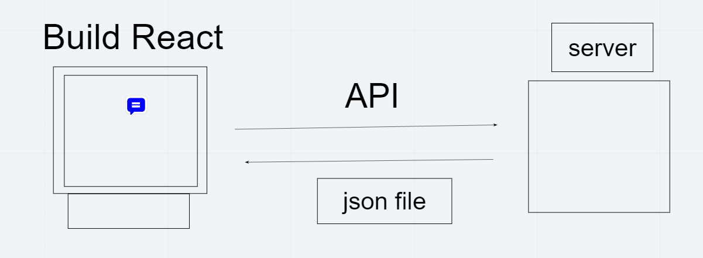
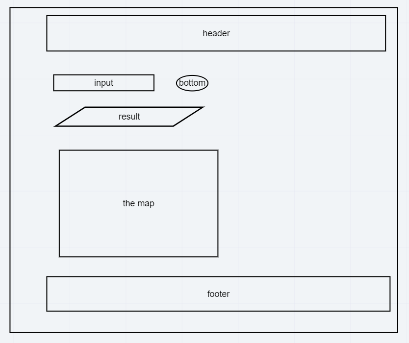

# city-explorer

**Author**: Sukina AbuHammad
**Version**: 1.0.0 

## Overview

## Getting Started
<!-- What are the steps that a user must take in order to build this app on their own machine and get it running? -->

## Architecture
<!-- Provide a detailed description of the application design. What technologies (languages, libraries, etc) you're using, and any other relevant design information. -->

## Change Log
<!-- Use this area to document the iterative changes made to your application as each feature is successfully implemented. Use time stamps. Here's an example:

01-01-2001 4:59pm - Application now has a fully-functional express server, with a GET route for the location resource. -->

## Credit and Collaborations
<!-- Give credit (and a link) to other people or resources that helped you build this application. -->

## Time Estimates
Name of feature: Lab6

Estimate of time needed to complete:2 hours

Start time:10:00 pm

Finish time: 2:00 am

Actual time needed to complete:4 hours

**************************************************************************************************************************
###  My partner was Abdallah Abu Khurma

#### He and I did a review code.He shared with me the code he wrote and I looked at it.  I understood most of it and which I did not understand  Abdallah  helped me to understand it.

#### So many use the state that I don't know what it means and how to use it. And also some functions that I do not understand what they do. But  Abdallah  helped me understand that which is not understood by me.

Name of feature: Lab7

Estimate of time needed to complete:3 hours

Start time:10:00 pm

Finish time: 3:00 am

Actual time needed to complete:5 hours

**************************************************************************************************************************
###  My partner was Sa'ed Jabali

#### He and I did a review code.He shared with me the code he wrote and I looked at it.  I understood most of it and which I did not understand Sa'ed  helped me to understand it.

#### So many use the server API  that I don't know what it means and how to use it. And also some functions that I do not understand what they do. But  Sa'ed  helped me understand that which is not understood by me.

Name of feature: Lab8

Estimate of time needed to complete:3 hours

Start time:10:45 pm

Finish time: 2:00 am

Actual time needed to complete: 3 hours and quarter

*********************************************************************************
Name of feature: Lab9

Estimate of time needed to complete:1 hours

Start time:10:00 pm

Finish time: 12:00am am

Actual time needed to complete: 2 hours and quarter

***********************************************************************************
Name of feature: Lab10

Estimate of time needed to complete:1 hours

Start time:1:00 am

Finish time: 1:30am 

Actual time needed to complete: half hour

